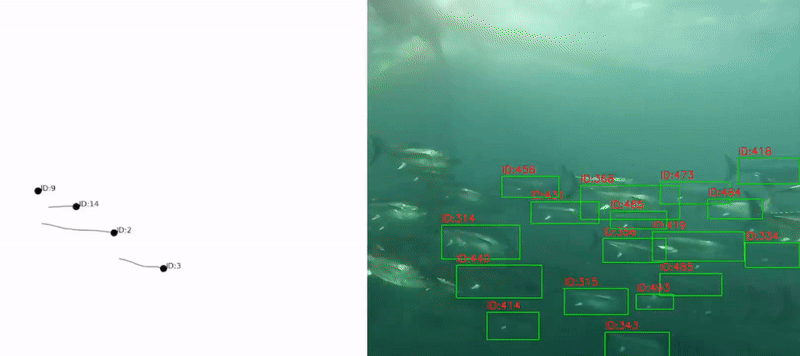

# Underwater Computer Vision: Automated Tuna Counting System

## 📌 Project Overview
Automated system designed for tuna farms to accurately count individuals during underwater transfers. The system ensures biological inventory control by processing high-density video feeds in real-time.

## 🛠️ Tech Stack
* **Computer Vision:** YOLO (Custom Trained)
* **Object Tracking:** DeepSORT (Identity Persistence)
* **Language:** Python
* **Data Science:** Custom Dataset Curation & Augmentation

## 🌊 The Challenge: Underwater Environment
Standard datasets failed due to light refraction, turbidity, and color shifting. 
* **Solution:** Built a proprietary dataset focusing on **anatomical morphology** rather than superficial features. 
* **Result:** Minimized overfitting and improved detection accuracy across diverse water conditions.

## 📊 Demonstration
Aquí es donde debes colocar tu GIF:

---

## 🔒 Confidentiality & Contact
This project was developed for a private organization. The source code is **confidential** and not publicly available.

For professional inquiries or more information regarding the methodology:
📩 **Email:** gonzalo.spinoza.2020@gmail.com
